# VisaFlow — System Architecture

_Last updated: 2026-06-09_

> Comprehensive architecture reference for VisaFlow, expressed primarily through Mermaid
> diagrams. It reflects the **current** state of `main`. Pair this with
> [`PROJECT_STATUS.md`](./PROJECT_STATUS.md) for status, risks, and gaps.

**Conventions**
- Paths are relative to the application root (the inner `visaflow-assistant-main/`).
- "Server function" = a `createServerFn` POST endpoint in `server/cases/actions.ts`.
- "RPC" = a Postgres function invoked via `supabase.rpc(...)`.
- All Mermaid blocks are standard GitHub‑flavored Mermaid.

---

## 1. System context

High‑level view of actors and external systems.

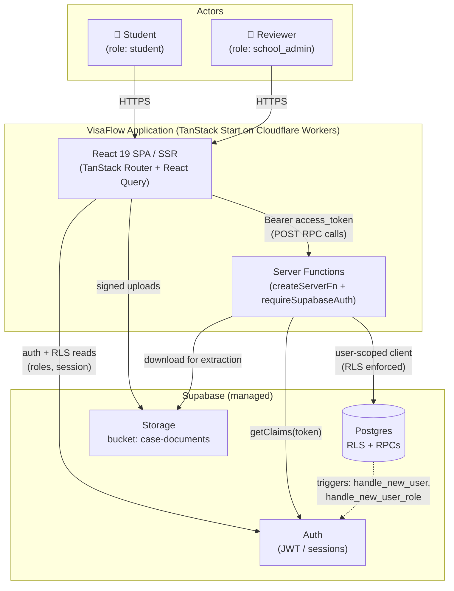

---

## 2. Deployment & infrastructure

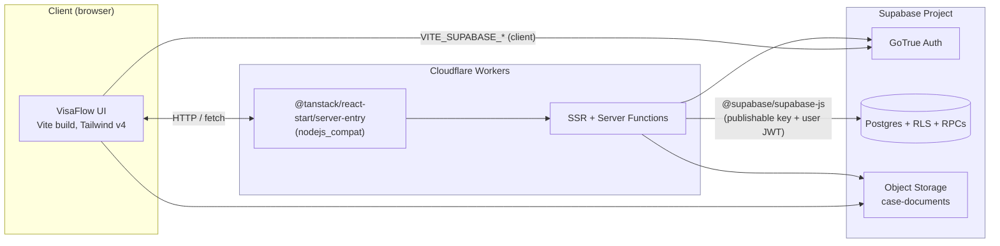

**Build & deploy chain**
- `vite build && tsc --noEmit` → `wrangler deploy`.
- Vite plugins: `@cloudflare/vite-plugin`, `tanstackStart`, `react`, `tailwindcss`,
  `vite-tsconfig-paths` (`@/*` alias).
- Env split: client uses `VITE_SUPABASE_*` (build‑time inlined); server uses
  `SUPABASE_URL` + `SUPABASE_PUBLISHABLE_KEY`; the optional service‑role admin client
  uses `SUPABASE_SERVICE_ROLE_KEY` (RLS‑bypassing, server‑only).

---

## 3. Layered component architecture

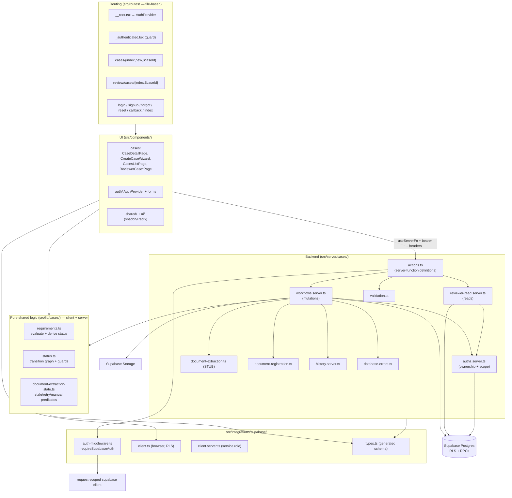

---

## 4. Authentication & authorization layers

Authorization is enforced **redundantly** at three layers: server‑function query
filters, RPC internal checks, and Postgres RLS.

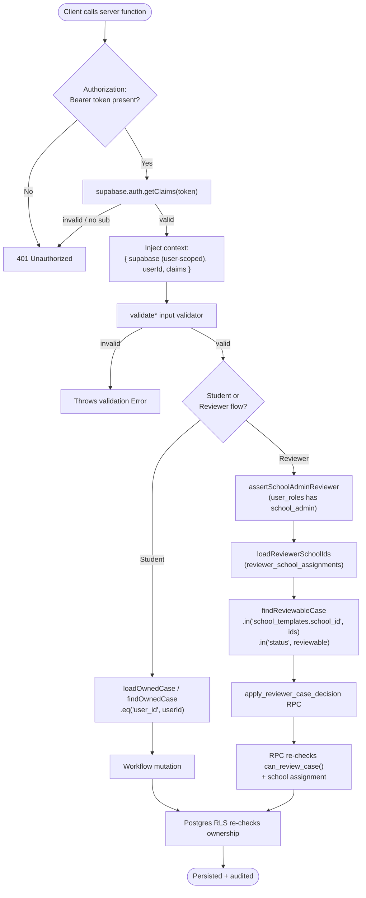

**Key points**
- The request‑scoped Supabase client forwards the user JWT, so **every query the
  handler makes is RLS‑constrained** even before explicit `.eq("user_id", ...)` filters.
- Reviewer writes are restricted to the `apply_reviewer_case_decision` RPC (no direct
  case updates), which re‑validates `can_review_case()` plus school assignment.
- The service‑role client (`client.server.ts`) bypasses RLS and is server‑only.

---

## 5. Request flow — student: upload document → extract → re‑evaluate

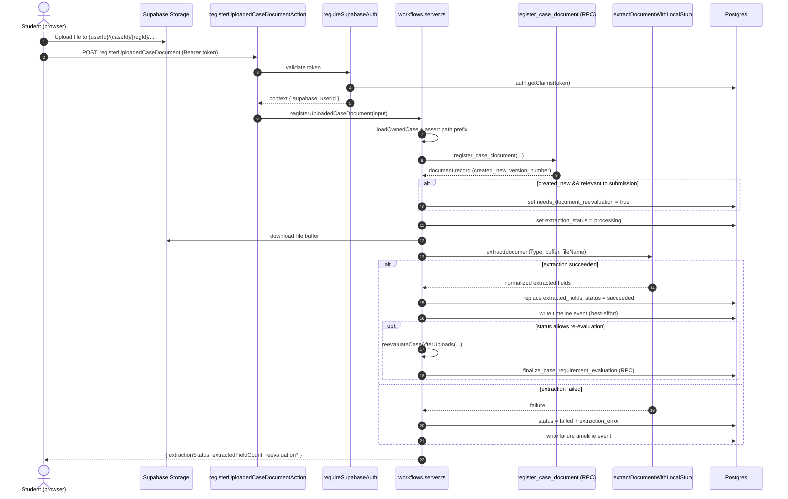

---

## 6. Request flow — student: manual extracted‑field review (atomic)

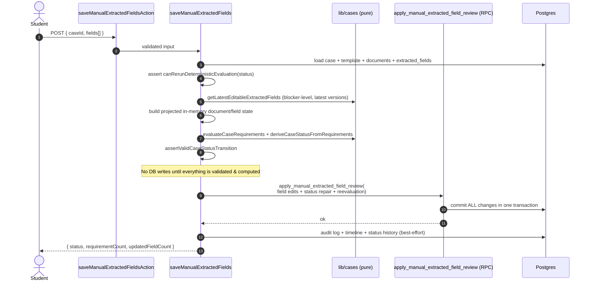

> Rationale: a later reevaluation‑persistence failure cannot leave partial primary‑state
> commits behind, because edits + status repair + reevaluation are one atomic RPC.

---

## 7. Request flow — reviewer decision

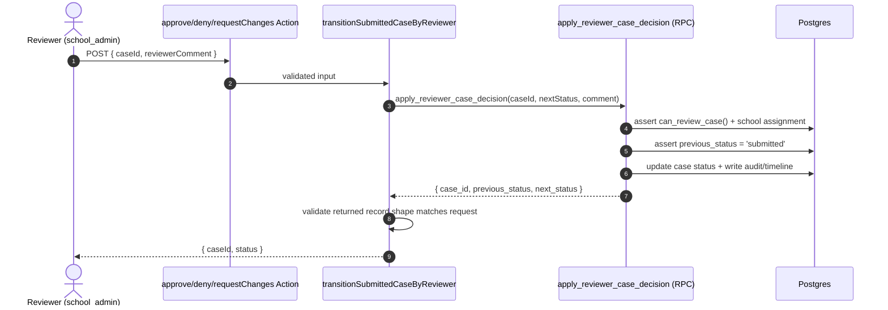

Decision targets: `approve → approved`, `deny → denied` (comment required),
`requestChanges → change_pending` (comment required).

---

## 8. Case status state machine

Source of truth: `CASE_STATUS_TRANSITIONS` in `lib/cases/status.ts`.

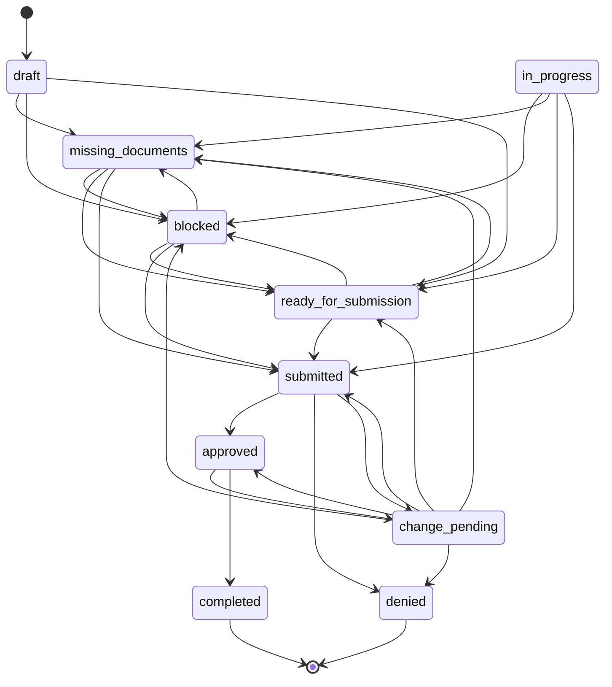

**Notes**
- Student‑driven, deterministic states (`draft, missing_documents, in_progress,
  blocked, ready_for_submission, change_pending`) are re‑evaluable
  (`DETERMINISTIC_REEVALUATION_STATUSES`).
- `submitted → approved|denied|change_pending` only via the reviewer RPC.
- Editing approval‑sensitive fields (`employer_name`, `work_location`, `start_date`,
  `end_date`) on an `approved` case is what `shouldMoveToChangePending` targets.

---

## 9. Document extraction lifecycle

`extraction_status` ∈ `pending | processing | succeeded | failed`
(`lib/cases/document-extraction-state.ts`).

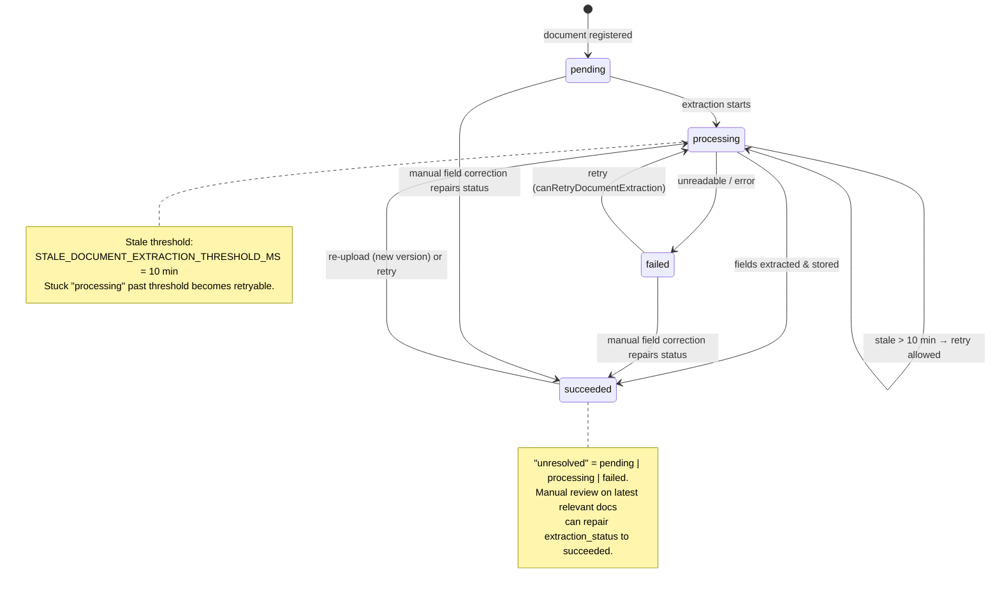

> Extraction itself is a **local text‑pattern stub** (`extractDocumentWithLocalStub`):
> regex alias matching over decoded file bytes, fixed confidence 0.35, date
> normalization to `YYYY-MM-DD`. No production OCR/AI. Binary/scanned files without
> readable text fail.

---

## 10. Requirement evaluation pipeline

```mermaid
flowchart LR
    TC["template config_json<br/>(school_templates)"] --> NC["normalizeCaseTemplateConfig"]
    NC -->|requirements present| Reqs["template requirements"]
    NC -->|empty| Defaults["built-in default CPT requirements<br/>(offer letter, employer, job title,<br/>job duties, dates, advisor approval,<br/>course registration, lead-time)"]

    Reqs --> Eval
    Defaults --> Eval

    subgraph Eval["evaluateCaseRequirements (per requirement type)"]
        D["document: has uploaded doc?"]
        CF["case_field: field present on case?"]
        EF["extracted_field: latest doc value present?"]
        LT["lead_time: days until start ≥ minDays?"]
    end

    Eval --> Rows["RequirementInsert[]<br/>(status: met/not_met/pending, severity)"]
    Rows --> Derive["deriveCaseStatusFromRequirements"]

    Derive -->|"0 blockers"| RFS["ready_for_submission"]
    Derive -->|"blockers incl. document"| MD["missing_documents"]
    Derive -->|"blockers, non-document"| BL["blocked"]
    Derive -->|"no requirements"| DR["draft"]

    RFS --> Persist["finalize_case_requirement_evaluation RPC<br/>(persist rows + status atomically)"]
    MD --> Persist
    BL --> Persist
```

---

## 11. Data model (ER diagram)

Derived from `integrations/supabase/types.ts` and the base migration. PK = `id`
(uuid) on all tables unless noted; FKs shown as relationships.

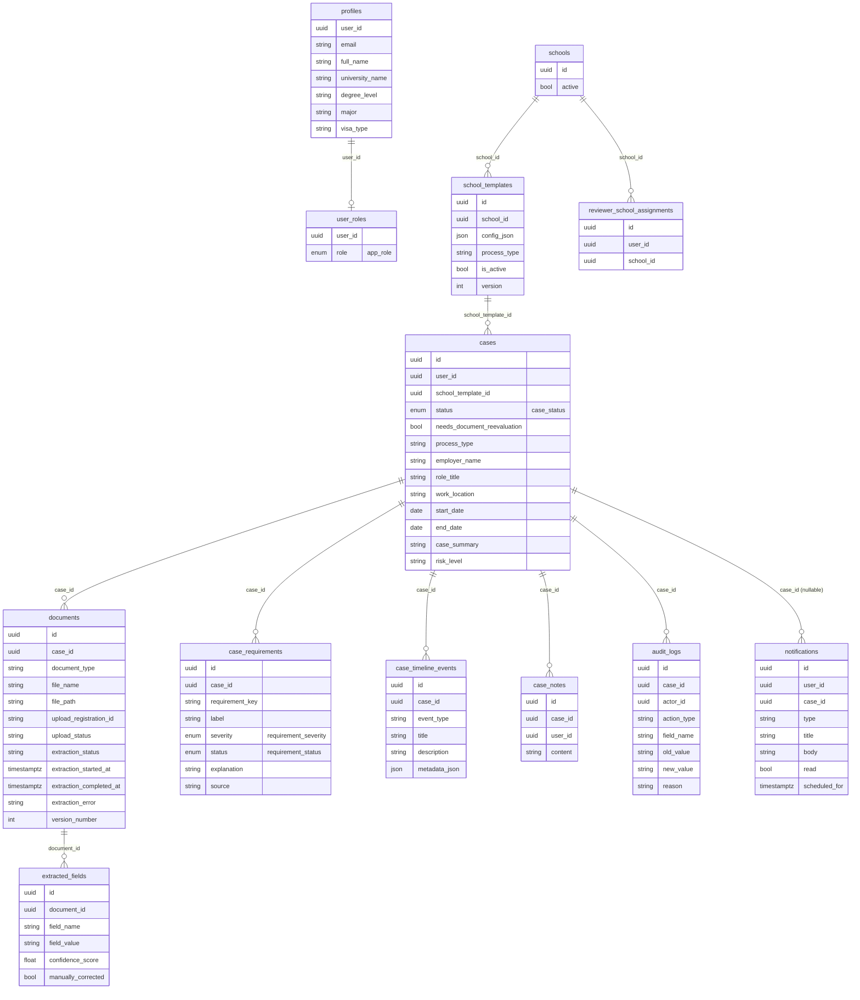

**Enums**
- `app_role`: `student | school_admin | advisor | employer`
- `case_status`: 10 values (see §8)
- `requirement_severity`: `blocker | warning | info`
- `requirement_status`: `pending | met | not_met | waived`

---

## 12. Server‑enforced RPCs (transaction boundaries)

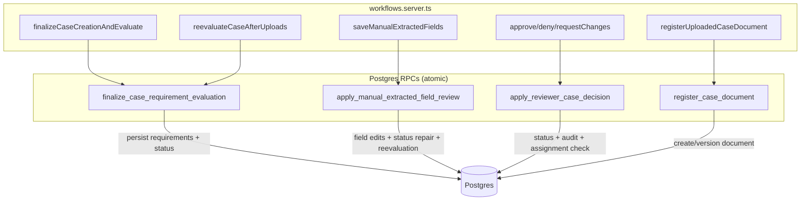

Each RPC is a single transaction, so a partial failure cannot leave inconsistent
primary state. RPC names are hardcoded constants in `workflows.server.ts`; the JS
projects state in memory, validates, then delegates the commit to the RPC.

---

## 13. Cross‑cutting concerns

| Concern | Where handled |
|---------|---------------|
| AuthN (token validation) | `integrations/supabase/auth-middleware.ts` |
| AuthZ (ownership/scope) | `server/cases/authz.server.ts` + RLS + RPC checks |
| Input validation | `server/cases/validation.ts` (hand‑written) |
| Error normalization | `server/cases/database-errors.ts` |
| Audit / timeline / status history | `server/cases/history.server.ts` (best‑effort writes) |
| Shared business rules | `src/lib/cases/*` (pure, client + server) |
| UI status/labels | `src/lib/constants.ts` |
| Type safety | `integrations/supabase/types.ts` (generated) + strict TS |

> "Best‑effort" history writes are wrapped so a logging failure does not abort the
> primary mutation.

---

## 14. Architectural principles observed

1. **Server is the source of truth.** The client re‑uses the same pure logic
   (`src/lib/cases/*`) for responsive UX, but the server re‑computes and persists.
2. **Atomic mutations via RPC.** Multi‑step writes are pushed into Postgres
   transactions to avoid partial state.
3. **Defense in depth for authz.** Query filters + RPC checks + RLS all enforce the
   same rules independently.
4. **Validate‑then‑commit.** Workflows build and validate a projected state in memory
   before any write (notably manual field review).
5. **Generated boundaries.** Supabase client/types and the route tree are generated and
   should be regenerated, not hand‑edited.

For known risks, fragile areas, gaps, and open questions, see
[`PROJECT_STATUS.md`](./PROJECT_STATUS.md) §13–15.

---

_Generated from a read‑only inspection of the codebase on 2026-06-09. Diagrams reflect
code paths in `src/server/cases/`, `src/lib/cases/`, `src/integrations/supabase/`, and
`supabase/migrations/`. Where the database column type is looser than the app‑level
constraint (e.g. `extraction_status` is `string` in generated types), the app‑level
constraint is shown._
